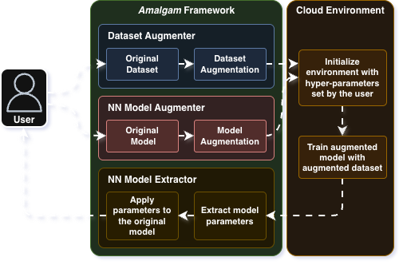

# Amalgam: A Framework for Obfuscated Neural Network Training on the Cloud

<p align="center">
  
</p>


Amalgam is an easy-to-use neural network obfuscation framework. Users simply need to upload a PyTorch model and a dataset. 
Currently, Amalgam supports vision language models written using the PyTorch framework.

Amalgam augments PyTorch models and datasets to be used for training with well-calibrated noise to “hide” both the original
model architectures and training datasets from the cloud.
After training, Amalgam extracts the original models from the augmented models and returns them to users.

## Features

- A simple-to-use API for PyTorch models and datasets
- Currently works with computer vision models and datasets
- Supports CUDA (Nvidia) and MPS (Apple Silicon) acceleration
- Supports fine-tuning an existing PyTorch model
- Incurs a moderate overhead compared to other privacy-preserving frameworks
- No accuracy loss

## Get Start

Install the required libraries from `requrements.txt`

```bash
pip install -r requirements.txt
```

Build the necessary CUDA shared objects. Check the [CUDA Backend](#cuda-backend) section for more details.
```bash
make
```

### Dataset Obfuscation
Download the example CIFAR-10 dataset.
```python
python download_dataset.py --path datasets
```

Initialize a dataset obfuscator for the trainset with a desired noise amount.
```python
from core.dataset_obfuscator import DatasetObfuscator

testset_obfuscator = DatasetObfuscator('datasets/cifar10_train.pt', amount=0.25)
```

To augmente the trainset with noise, you can either provide your own noise or generate noise with uniform or gaussian distribution.
```python
noise = testset_obfuscator.generate_noise(0.25, 'uniform')
```

Now, you generate random indices for each channel where the noise will be augmented and set the random indices.
```python
aug_indices = testset_obfuscator.generate_random_indices(noise.shape)
testset_obfuscator.set_random_aug_indices(aug_indices)
```

Finally, the trainset can be obfuscated and saved to a desired location
```Python
testset_obfuscator.augment_dataset(noise)
testset_obfuscator.save_augmented_dataset('datasets/cifar10_train_obfuscated.pt')
```


Repeat for test dataset with same augmentation indices. Make sure to use the same augmentation indices for expected results.
```python
trainset_obfuscator = DatasetObfuscator('datasets/cifar10_test.pt', amount=0.25)
noise = trainset_obfuscator.generate_noise(0.25, 'uniform')
trainset_obfuscator.set_random_aug_indices(aug_indices)  # Use same indices as train set
trainset_obfuscator.augment_dataset(noise)
trainset_obfuscator.save_augmented_dataset('datasets/cifar10_test_obfuscated.pt')
```

### Prepare the Model

Initilize the original model. Here, an example is provided with ResNet.
```python
import torch
from core.model_obfuscator import ModelObfuscator
from models.resnet import ResNet18

model = ResNet18(num_classes=10, num_channel=3)
```

Initialize a model obfuscator and pass the origina model.

```python
model_obfuscator = ModelObfuscator(model)
```

Replace the first conv layer with the custom conv layer designed for Amalgam. Pass the augmentation indices and the original demantion of the train data.
```python
model_obfuscator.replace_first_conv_layer(aug_indices=aug_indices, deanon_dim=(32, 32))
```

The model is now ready to be trained with the obfuscated dataset.
```python
amalgam_model = model_obfuscator.get_obfuscated_model()

# Train the obfuscated model with obfuscated dataset
# (obfuscated model can be trained on cloud with obfs_samples and labels)

# After training, deobfuscate the model to recover the original
deobfuscated_model = model_obfuscator.deobfuscate_model()
```

## CUDA Backend

The CUDA files in `core/cuda` need to be compiled into shared objects before the CUDA backend can be used. The CUDA backend should provide better performance.

### CUDA requirements (Linux)

To build and run the CUDA backend you need a working CUDA development environment. Minimum/recommended items:

- NVIDIA driver compatible with your CUDA Toolkit version (install driver from NVIDIA).  
- CUDA Toolkit (nvcc, runtime, dev headers). Recommended: CUDA 11.7+ (11.8 or 12.x commonly used). Match the toolkit version with any prebuilt libtorch you use.
- cuBLAS and cuBLASLt (shipped with the CUDA Toolkit) — required for GEMM/FP32/FP8 paths.
- nvcc in PATH and the CUDA libraries in LD_LIBRARY_PATH:
  - export PATH=/usr/local/cuda/bin:$PATH
  - export LD_LIBRARY_PATH=/usr/local/cuda/lib64:$LD_LIBRARY_PATH
- CMake >= 3.18 (required for modern CUDA + libtorch CMake integration).
- A host compiler compatible with your CUDA/toolkit and libtorch (GCC 9–12 typically safe; check libtorch docs for ABI compatibility).

- A CUDA-capable NVIDIA GPU with compute capability >= 6.0 is recommended for good performance.

**Use the Makefile to compile the CUDA files:**
```bash
make
```

## Cite
Please cite the work using the following bibtex
```bibtex
@inproceedings{10.1145/3652892.3700762,
   author = {Taki, Sifat Ut and Mastorakis, Spyridon},
   title = {Amalgam: A Framework for Obfuscated Neural Network Training on the Cloud},
   year = {2024},
   isbn = {9798400706233},
   publisher = {Association for Computing Machinery},
   address = {New York, NY, USA},
   url = {https://doi.org/10.1145/3652892.3700762},
   doi = {10.1145/3652892.3700762},
   booktitle = {Proceedings of the 25th International Middleware Conference},
   pages = {238–251},
   numpages = {14},
   location = {Hong Kong, Hong Kong},
   series = {Middleware '24}
}
```